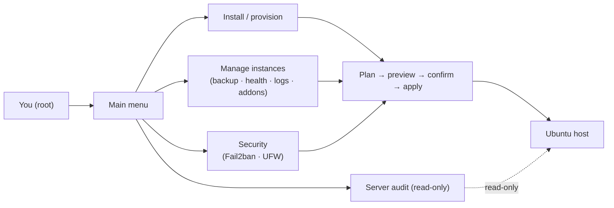

# Odoo Instance Manager

Run and maintain several **Odoo Community** sites on a single Ubuntu server — from a simple interactive menu,
without memorizing dozens of `apt`, `psql`, `systemctl`, and `nginx` commands.

If you self-host Odoo on your own Ubuntu server (one site or many) and want provisioning, backups, TLS, a
firewall, and health checks in one place — and you want to **see exactly what will run before it runs** — this
tool is for you. If you use Odoo's SaaS/Online or a managed host, you don't need it.

## What it does for you

- **Set up a new Odoo site in minutes** — creates the system user, clones Odoo, builds the virtualenv, writes
  the config and systemd service, and optionally sets up PostgreSQL, Nginx, and TLS.
- **Run many sites on one server** — each instance is isolated (its own service, ports, config, and database),
  all derived from a name, so they don't collide.
- **Keep them secure** — Fail2ban jails, a UFW firewall baseline, and TLS certificate management.
- **Keep them healthy** — a one-look health check (service, HTTP, database, disk), disk-usage reports, and log
  rotation.
- **Never lose data** — manual or **scheduled automatic backups**, plus restore and duplicate, all with
  retention.
- **Know what you have** — a read-only whole-server audit and an addon inventory (Odoo core / OCA / custom,
  with versions and which are installed).

## Why you can trust it

- **You approve every change.** Each action shows the exact list of commands and runs them only after you
  confirm; anything destructive also requires typing a confirmation phrase.
- **Nothing to install.** Pure **Python 3.12 standard library** — no pip packages, no runtime dependencies.
- **Self-cleaning.** If an install fails partway, it rolls back its own residues so you can retry cleanly.

## Requirements

- An **Ubuntu 24.04** server, run as **root** (`sudo`).
- **Python 3.12+** (ships with 24.04). Nothing else.

The interface is available in **Spanish** (default) or **English** — chosen at startup or via `OIM_LANG=en|es`
(see [Interface language](docs/language.md)).

## Quickstart

```bash
# On the Ubuntu 24.04 server, as root:
sudo python3 odoo_instance_manager.py
```

Then pick an action from the main menu — for example **Menú de instalación** to create a new Odoo site, or
**Gestionar instancias** to manage an existing one. Every action shows its full command plan and waits for your
confirmation before touching the system.



## Documentation

**Set up**

- [Installing and provisioning instances](docs/installation.md) — install modes, ports, Nginx, TLS.
- [Configuration reference](docs/configuration-reference.md) — every field, default, and derived path.

**Daily operations** ([docs/operations/](docs/operations/))

- [Managing existing instances](docs/operations/instance-management.md) — status, updates, services,
  backup/restore, duplicate, removal.
- [Instance health check](docs/operations/health-check.md) — read-only check of service, HTTP, database, disk.
- [Scheduled backups](docs/operations/scheduled-backups.md) — unattended backups on a systemd timer.
- [Disk usage & retention](docs/operations/disk-usage.md) — instance footprint and pruning old backups.
- [Log rotation](docs/operations/log-rotation.md) — system logrotate for an instance's logs.
- [Addon inventory](docs/operations/addon-inventory.md) — modules by origin (core/OCA/custom) with versions.

**Security** ([docs/security/](docs/security/))

- [Fail2ban protection](docs/security/security-fail2ban.md) — base hardening and per-instance jails.
- [Firewall (UFW)](docs/security/firewall.md) — install and manage a UFW baseline.
- [Safe controls](docs/security/safe-controls.md) — the runtime guardrails and permissions baseline.

**Audit & understand**

- [Auditing a server](docs/server-audit.md) — the read-only whole-server report.
- [Architecture](docs/architecture.md) — the layered design and the plan → preview → apply flow.
- [Glossary](docs/glossary.md) — domain vocabulary (instance, filestore, jail, neutralize, …).
- [Interface language](docs/language.md) — choose Spanish or English.

**Behavior specs** live under [`openspec/specs/`](openspec/specs/) — validated with `openspec validate --specs`.
**Decisions** are recorded in [`docs/decisions/`](docs/decisions/).

## Contributing

Read [CONTRIBUTING.md](CONTRIBUTING.md) and [CLAUDE.md](CLAUDE.md). Non-trivial changes are spec-first via the
OpenSpec flow; keep planners pure and never weaken a safety control. Security policy: [SECURITY.md](SECURITY.md).

## License

[AGPL-3.0-or-later](LICENSE).
