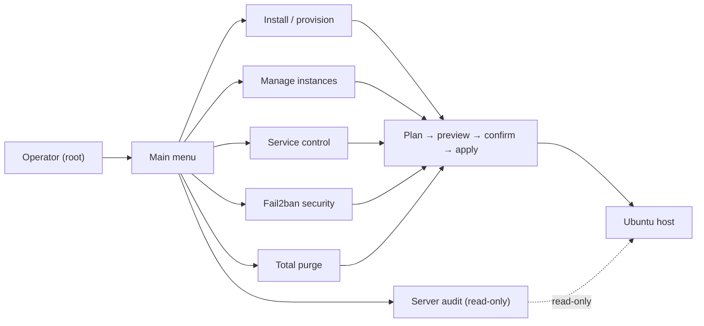

# Odoo Instance Manager

Interactive, **root-run** Python CLI to **install, maintain, and audit multi-instance Odoo Community
servers** on Ubuntu 24.04. It never mutates the host blindly: every action builds a command **plan**,
previews it, and applies it only after you confirm — with an extra typed phrase for anything destructive.

- **Multi-instance** — many isolated Odoo instances per host, each with its own service, ports, config, and
  database, all derived from the instance name.
- **Safe by construction** — pure planners build the plan; you see every command before it runs; installs
  self-clean on failure. See [ADR 0001](docs/decisions/0001-plan-preview-apply-safety.md).
- **Batteries included** — provisioning (Odoo/PostgreSQL/both), Nginx + TLS, service control, backup /
  restore / duplicate, Fail2ban hardening, and a read-only server audit.
- **No runtime dependencies** — Python 3.12+ standard library only.

## At a glance



## Quickstart

```bash
# On the Ubuntu 24.04 server, as root:
sudo python3 odoo_instance_manager.py
```

Then pick an action from the main menu:

- **Menú de instalación** → provision an Odoo instance, PostgreSQL, or both.
- **Gestionar instancias** → status, config updates, backup/restore, duplicate, delete.
- **Servicios instancias** → start/stop/restart/enable/disable instance services.
- **Seguridad Fail2ban** → base hardening and per-instance Odoo jails.
- **Informe para servidor externo** → a read-only audit report.

Every action shows its full command plan and waits for your confirmation before touching the system.

## Documentation

**Get things done**

- [Installing and provisioning instances](docs/installation.md) — install modes, ports, Nginx, TLS.
- [Managing existing instances](docs/instance-management.md) — status, updates, services, backup/restore,
  duplicate, removal.
- [Log rotation](docs/log-rotation.md) — configure and query system logrotate for an instance's Odoo log.
- [Instance health check](docs/health-check.md) — read-only check of service, HTTP, database, and disk.
- [Disk usage & retention](docs/disk-usage.md) — instance footprint and pruning old backups.
- [Addon inventory](docs/addon-inventory.md) — modules by origin (core/OCA/custom) with versions and installed state.
- [Scheduled backups](docs/scheduled-backups.md) — unattended backups on a systemd timer, with retention.
- [Fail2ban protection](docs/security-fail2ban.md) — base hardening, per-instance jails, real-IP checks.
- [Firewall (UFW)](docs/firewall.md) — install and manage a UFW baseline (SSH/HTTP/HTTPS + PostgreSQL).
- [Auditing a server](docs/server-audit.md) — the read-only external report.

**Understand & reference**

- [Architecture](docs/architecture.md) — the layered design and the plan → preview → apply flow.
- [Configuration reference](docs/configuration-reference.md) — `InstanceConfig` fields, defaults, and derived
  paths.
- [Glossary](docs/glossary.md) — domain vocabulary (instance, filestore, jail, neutralize, …).
- [Safe controls](docs/safe-controls.md) — runtime guardrails and the permissions baseline.

**Behavior specs** live under [`openspec/specs/`](openspec/specs/) — nine capabilities validated with
`openspec validate --specs`. **Decisions** are recorded in [`docs/decisions/`](docs/decisions/).

## Contributing

Read [CONTRIBUTING.md](CONTRIBUTING.md) and [CLAUDE.md](CLAUDE.md). Non-trivial changes are spec-first via the
OpenSpec flow (`/opsx:propose → /opsx:apply → /opsx:archive`); keep planners pure and never weaken a safety
control. Security policy: [SECURITY.md](SECURITY.md).

## License

See [LICENSE](LICENSE).
