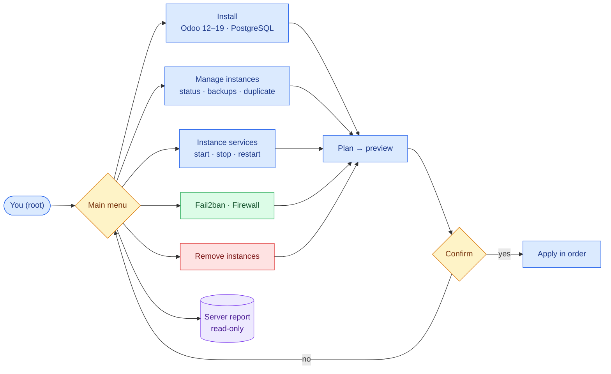

# Odoo Instance Manager

Run and maintain several **Odoo Community** sites on a single Ubuntu server — from a simple interactive menu,
without memorizing dozens of `apt`, `psql`, `systemctl`, and `nginx` commands.

If you self-host Odoo on your own Ubuntu server (one site or many) and want provisioning, backups, TLS, a
firewall, and health checks in one place — and you want to **see exactly what will run before it runs** — this
tool is for you. If you use Odoo's SaaS/Online or a managed host, you don't need it.

## What it does for you

- **Set up a new Odoo site, any version from 12 to 19** — creates the system user, clones official Odoo or
  OCA's **OCB**, builds the virtualenv with the Python and setuptools that version needs (installing a matching
  Python with uv when the server's own cannot build it), writes the config and systemd service, and optionally
  sets up PostgreSQL, Nginx, and TLS.
- **Run many sites on one server** — each instance is isolated (its own service, ports, config, and database),
  all derived from a name, so they don't collide.
- **Keep them secure by default** — strong random master/DB passwords, a hidden database manager
  (`list_db = False`), a `dbfilter`, and encrypted remote DB connections — each recommended but always your
  informed choice, with warnings. Plus Fail2ban jails, a UFW firewall baseline, and TLS management.
- **Get working PDFs and right-sized performance** — optional checksum-verified **wkhtmltopdf** (for invoice
  and report PDFs), and `workers`/memory limits derived from the server's CPU and RAM.
- **Run on your stack, not just one** — detects the OS codename, nginx, PostgreSQL, and Odoo version and
  writes version-correct config (see [Supported platforms](docs/platforms.md)).
- **Keep them healthy** — a one-look health check (service, HTTP, database, disk), disk-usage reports, and log
  rotation.
- **Never lose data** — manual or **scheduled automatic backups** with retention per database, plus restore
  and duplicate.
- **Copy production safely** — a restored or duplicated database is **neutralised** before any Odoo can see it:
  no mail leaves, no cron, payment, EDI or webhook runs as production, and a check confirms it.
- **Know what you have** — a read-only whole-server audit and an addon inventory (Odoo core / OCA / custom,
  with versions and which are installed).

## Why you can trust it

- **You approve every change.** Each action shows the exact list of commands and runs them only after you
  confirm; anything destructive also requires typing a confirmation phrase.
- **Nothing to install.** Pure **Python 3.12 standard library** — no pip packages, no runtime dependencies.
- **Self-cleaning.** If an install fails partway, it rolls back its own residues so you can retry cleanly.

## Requirements

- A **Debian/Ubuntu (apt) server**, run as **root** (`sudo`) — validated on **Ubuntu 24.04**, and
  version-adaptive across other releases (see [Supported platforms](docs/platforms.md)).
- **Python 3.12+** (ships with 24.04). Nothing else.

The interface is available in **English** (default) or **Spanish** — chosen at startup or via `OIM_LANG=en|es`
(see [Interface language](docs/language.md)).

## Quickstart

```bash
# On the Ubuntu 24.04 server, as root:
sudo python3 odoo_instance_manager.py
```

Then pick an action from the main menu — for example **Installation menu** to create a new Odoo site, or
**Manage instances** to manage an existing one. Every action shows its full command plan and waits for your
confirmation before touching the system; a destructive action also asks you to type a confirmation phrase.


```mermaid
flowchart LR
    op(["You (root)"]) --> menu{"Main menu"}
    menu --> install["Install<br/>Odoo 12–19 · PostgreSQL"]
    menu --> manage["Manage instances<br/>status · backups · duplicate"]
    menu --> services["Instance services<br/>start · stop · restart"]
    menu --> sec["Fail2ban · Firewall"]
    menu --> remove["Remove instances"]
    menu --> report[("Server report<br/>read-only")]
    install & manage & services & sec & remove --> plan["Plan → preview"]
    plan --> confirm{"Confirm"}
    confirm -- yes --> apply["Apply in order"]
    confirm -- no --> menu
    classDef step fill:#dbeafe,stroke:#2563eb,color:#1e3a8a
    classDef ask fill:#fef3c7,stroke:#d97706,color:#78350f
    classDef guard fill:#dcfce7,stroke:#16a34a,color:#14532d
    classDef stop fill:#fee2e2,stroke:#dc2626,color:#7f1d1d
    classDef data fill:#ede9fe,stroke:#7c3aed,color:#4c1d95
    class op,install,manage,services,plan,apply step
    class menu,confirm ask
    class sec guard
    class remove stop
    class report data
```

## Documentation

**Set up**

- [Installing and provisioning instances](docs/installation.md) — install modes, Odoo version and core, Python,
  ports, Nginx, TLS.
- [Configuration reference](docs/configuration-reference.md) — every field, default, and derived path.
- [What it offers & supported platforms](docs/platforms.md) — capabilities and the OS/nginx/PostgreSQL/Odoo
  support matrix.

**Daily operations** ([docs/operations/](docs/operations/))

- [Managing existing instances](docs/operations/instance-management.md) — status, updates, services,
  backup/restore, duplicate and neutralise, removal.
- [Instance health check](docs/operations/health-check.md) — read-only check of service, HTTP, database, disk.
- [Scheduled backups](docs/operations/scheduled-backups.md) — unattended backups on a systemd timer.
- [Disk usage & retention](docs/operations/disk-usage.md) — instance footprint and pruning old backups.
- [Log rotation](docs/operations/log-rotation.md) — system logrotate for an instance's logs.
- [Addon inventory](docs/operations/addon-inventory.md) — modules by origin (core/OCA/custom) with versions.

**Security** ([docs/security/](docs/security/))

- [Fail2ban protection](docs/security/security-fail2ban.md) — base hardening and per-instance jails.
- [Firewall (UFW)](docs/security/firewall.md) — install and manage a UFW baseline.
- [Safe controls](docs/security/safe-controls.md) — the runtime guardrails and permissions baseline.

**Audit & understand**

- [Auditing a server](docs/server-audit.md) — the read-only whole-server report.
- [Architecture](docs/architecture.md) — the layered design and the plan → preview → apply flow.
- [Glossary](docs/glossary.md) — domain vocabulary (instance, filestore, jail, neutralize, …).
- [Interface language](docs/language.md) — choose Spanish or English.

**Behavior specs** live under [`openspec/specs/`](openspec/specs/) — validated with `openspec validate --specs`.
**Decisions** are recorded in [`docs/decisions/`](docs/decisions/).

## Contributing

Read [CONTRIBUTING.md](CONTRIBUTING.md) and [AGENTS.md](AGENTS.md). Non-trivial changes are spec-first via the
OpenSpec flow; keep planners pure and never weaken a safety control. Security policy: [SECURITY.md](SECURITY.md).

## License

[AGPL-3.0-or-later](LICENSE).
