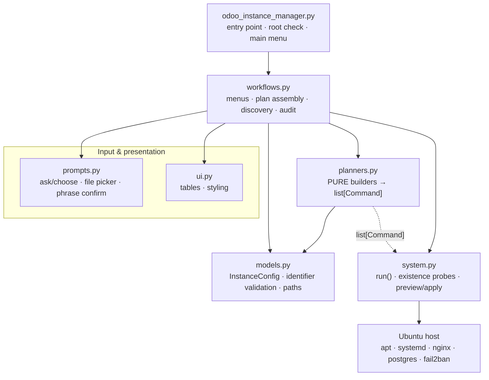
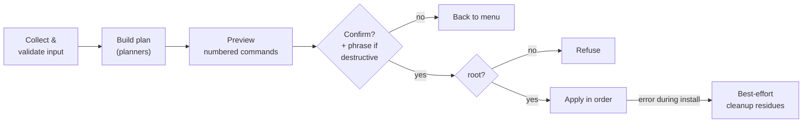

# Architecture

Odoo Instance Manager is a single Python package with a **strict layering**: input, modelling, and rendering
are separated from *building* command plans, which is separated from *executing* them. The guiding rule is
that **building a command is not running it** — planners are pure, execution is isolated, and every mutation
passes an operator gate.

## Layers

| Layer | Module | Responsibility | Side effects |
|-------|--------|----------------|--------------|
| Entry | `odoo_instance_manager.py` | Enforce root, configure UTF-8, main menu loop | Reads UID, prints |
| Orchestration | `instance_manager/workflows.py` | Collect input, assemble plans, run discovery and the read-only audit | Via `system.py` only |
| Model | `instance_manager/models.py` | `InstanceConfig`, identifier validation, path derivation | None (pure) |
| Planning | `instance_manager/planners.py` | Build `list[Command]` for every action | **None (pure)** |
| Execution | `instance_manager/system.py` | `run()`, existence checks, `preview_commands`, `apply_commands` | Runs shell |
| Input | `instance_manager/prompts.py` | Interactive prompts, file picker, phrase confirmation | Reads stdin |
| Render | `instance_manager/ui.py` | Terminal tables, tags, colors | Prints |

## The core flow

Every host-mutating action follows the same pipeline (specified as the `execution-safety` capability):

- **Commands** are `(description, command)` pairs (`system.Command`). A plan is just a `list[Command]`.
- `preview_commands` renders the whole plan before anything runs; `apply_commands` runs it, stopping on error
  (and re-raising so install flows can clean up).
- Destructive actions add `confirm_with_phrase` — the operator must type an exact phrase naming the
  operation and instance.

See [ADR 0001](decisions/0001-plan-preview-apply-safety.md) for the rationale, and the
[configuration reference](configuration-reference.md) for the paths every plan derives from an instance name.

## Why planners are pure

Because `planners.py` performs no I/O and no execution, a plan can be **shown, reviewed, and reasoned about**
before it touches the host. This is what makes the preview meaningful and keeps the injection surface at the
single boundary where operator input is quoted and validated. Keeping this purity is a hard contribution rule.
