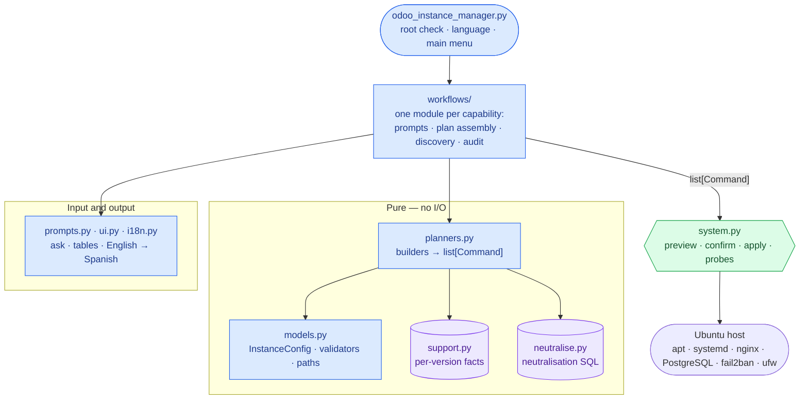
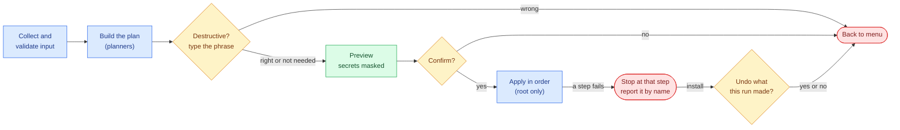

# Architecture

Odoo Instance Manager is a single Python package with a **strict layering**: input, modelling, and rendering
are separated from *building* command plans, which is separated from *executing* them. The guiding rule is
that **building a command is not running it** — planners are pure, execution is isolated, and every mutation
passes an operator gate.

## Layers

```mermaid
flowchart TD
    entry(["odoo_instance_manager.py<br/>root check · language · main menu"])
    workflows["workflows/<br/>one module per capability:<br/>prompts · plan assembly · discovery · audit"]
    subgraph pure["Pure — no I/O"]
        models["models.py<br/>InstanceConfig · validators · paths"]
        support[("support.py<br/>per-version facts")]
        neutralise[("neutralise.py<br/>neutralisation SQL")]
        planners["planners.py<br/>builders → list[Command]"]
    end
    subgraph io["Input and output"]
        prompts["prompts.py · ui.py · i18n.py<br/>ask · tables · English → Spanish"]
    end
    system{{"system.py<br/>preview · confirm · apply · probes"}}
    host(["Ubuntu host<br/>apt · systemd · nginx · PostgreSQL · fail2ban · ufw"])

    entry --> workflows
    workflows --> prompts
    workflows --> planners
    planners --> models & support & neutralise
    workflows -- "list[Command]" --> system
    system --> host
    classDef step fill:#dbeafe,stroke:#2563eb,color:#1e3a8a
    classDef guard fill:#dcfce7,stroke:#16a34a,color:#14532d
    classDef data fill:#ede9fe,stroke:#7c3aed,color:#4c1d95
    class entry,workflows,planners,models,prompts step
    class support,neutralise data
    class system guard
```

| Layer | Module | Responsibility | Side effects |
|-------|--------|----------------|--------------|
| Entry | `odoo_instance_manager.py` | Enforce root, configure UTF-8, main menu loop | Reads UID, prints |
| Orchestration | `instance_manager/workflows/` (one module per capability) | Collect input, assemble plans, run discovery and the read-only audit | Mostly via `system.py`; also reads files and writes the optional audit report |
| Model | `instance_manager/models.py` | `InstanceConfig`, identifier validation, path derivation | None (pure) |
| Version facts | `instance_manager/support.py` | Per Odoo version: Python range and fallback, setuptools pin, PostgreSQL floor, core repositories, the pinned uv | None (pure data) |
| Neutralisation | `instance_manager/neutralise.py` | The rules that make a copied database unable to act as production, as SQL | None (pure) |
| Planning | `instance_manager/planners.py` | Build `list[Command]` for every action | **None (pure)** |
| Execution | `instance_manager/system.py` | `run()`, existence checks, `preview_commands`, `apply_commands` | Runs shell |
| Input | `instance_manager/prompts.py` | Interactive prompts, file picker, phrase confirmation | Reads stdin |
| Render | `instance_manager/ui.py` | Terminal tables, tags, colors | Prints |
| Language | `instance_manager/i18n.py` | The English → Spanish catalog, `t`/`tf` | None |

## The core flow

Every host-mutating action follows the same pipeline (specified as the `execution-safety` capability):

```mermaid
flowchart LR
    collect["Collect and<br/>validate input"] --> build["Build the plan<br/>(planners)"]
    build --> phrase{"Destructive?<br/>type the phrase"}
    phrase -- wrong --> menu(["Back to menu"])
    phrase -- right or not needed --> preview["Preview<br/>secrets masked"]
    preview --> confirm{"Confirm?"}
    confirm -- no --> menu
    confirm -- yes --> apply["Apply in order<br/>(root only)"]
    apply -- a step fails --> stop(["Stop at that step<br/>report it by name"])
    stop -- install --> cleanup{"Undo what<br/>this run made?"}
    cleanup -- yes or no --> menu
    classDef step fill:#dbeafe,stroke:#2563eb,color:#1e3a8a
    classDef ask fill:#fef3c7,stroke:#d97706,color:#78350f
    classDef guard fill:#dcfce7,stroke:#16a34a,color:#14532d
    classDef stop fill:#fee2e2,stroke:#dc2626,color:#7f1d1d
    class collect,build,apply step
    class phrase,confirm,cleanup ask
    class preview guard
    class stop,menu stop
```

- **Commands** are `system.Command(description, command, env, display)`. A plan is just a `list[Command]`.
  Secrets never go in `command`: a password or a file holding one travels in `env` (the step's environment,
  readable only by root, unlike its arguments, which `ps` shows every user), and `display` is what the preview
  shows instead, with the secrets masked. A failed step is reported by its description.
- Destructive actions first ask for `confirm_with_phrase` — the operator types an exact phrase naming the
  operation and instance — and only then show the plan.
- `preview_commands` renders the whole plan before anything runs; `apply_commands` runs it in order and stops
  at the first failing step. An install that fails, or is interrupted with Ctrl+C while it runs, previews the
  steps that undo what it made and asks before running them; then it returns to the menu.

## Diagram conventions

Diagrams in these pages share five colour classes, each also stated by the node's label:

| Class | Meaning | `classDef` |
|-------|---------|------------|
| `step` | an action | `fill:#dbeafe,stroke:#2563eb,color:#1e3a8a` |
| `ask` | a decision or a confirmation | `fill:#fef3c7,stroke:#d97706,color:#78350f` |
| `guard` | a safeguard: a check, a validation, a rollback | `fill:#dcfce7,stroke:#16a34a,color:#14532d` |
| `stop` | an end: refused, failed, removed | `fill:#fee2e2,stroke:#dc2626,color:#7f1d1d` |
| `data` | data or facts: a database, a file, a report | `fill:#ede9fe,stroke:#7c3aed,color:#4c1d95` |

See [ADR 0001](decisions/0001-plan-preview-apply-safety.md) for the rationale, and the
[configuration reference](configuration-reference.md) for the paths every plan derives from an instance name.

## Why planners are pure

Because `planners.py` performs no I/O and no execution, a plan can be **shown, reviewed, and reasoned about**
before it touches the host. This is what makes the preview meaningful and keeps the injection surface at the
single boundary where operator input is quoted and validated. Keeping this purity is a hard contribution rule.
