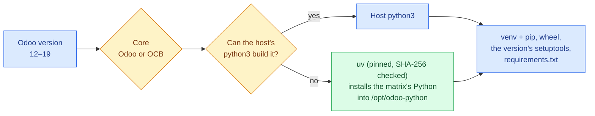

# Installing and provisioning instances

This guide covers the **Installation menu** and its provisioning modes. All actions preview their command
plan before applying — see [Architecture](architecture.md).

## Prerequisites

- A **Debian/Ubuntu (apt) family** server, validated on Ubuntu 24.04. Configuration is version-adaptive, so
  other apt releases work too — see [supported platforms](platforms.md).
- Python 3.12+ available as `python3` (the tool uses 3.12 syntax).
- Run as root: the tool refuses to start otherwise.

```bash
sudo python3 odoo_instance_manager.py
```

## Provisioning modes

From **Installation menu** you choose one of three modes:

| Mode | What it does |
|------|--------------|
| **Install Odoo instance** | Ensures the DB role/login, runs the Odoo base setup, and optionally configures Nginx. Does **not** install PostgreSQL. |
| **Install PostgreSQL (without Odoo)** | Installs and enables PostgreSQL, ensures the instance role, validates login, and optionally opens remote access. |
| **Install Odoo instance + PostgreSQL** | DB setup on this host followed by the Odoo base setup, and optionally Nginx. Odoo reaches PostgreSQL over loopback, so nothing is opened to the network. |

## What the Odoo base setup does

For an instance named `<instance>` (see the [configuration reference](configuration-reference.md) for every
derived path):

1. Installs OS build dependencies and the PostgreSQL client (apt runs unattended and waits for the dpkg lock).
2. Creates the system user `<instance>` and the directory layout under `/opt/odoo/<instance>`
   (`odoo`, `addons-oca`, `addons-custom`) plus `/etc/odoo/<instance>` and the data dir
   `/var/lib/odoo/<instance>` (filestores and sessions, outside the home). `/var/log/odoo` stays root's; the
   instance owns only its own log, `/var/log/odoo/<instance>.log`.
3. Clones the core you chose — **Odoo** (official) or **OCB** (OCA's backports, same branches) — at the
   requested branch (only if absent).
4. Builds the virtualenv with the Python interpreter the version needs (see below), installs pip, wheel and the
   setuptools the version needs, then `requirements.txt`.
5. Writes `/etc/odoo/<instance>/<instance>.conf` (mode `640`, owner `root:<instance>`).
6. Writes the systemd unit (after Odoo's own: `KillMode=mixed`, started after a local PostgreSQL) and reloads
   systemd.
7. Enables + starts the service, or just starts it, depending on your autostart choice.

### Odoo version, Python and setuptools

You type the Odoo version (12–19) and choose the core; the branch defaults to `<version>.0`. Before the plan is
shown, the tool decides which Python builds the virtualenv:



The host's `python3` "can build" a version when it is inside the version's Python range, is not 3.10 for Odoo
16–19 (their requirements pin a gevent for 3.10 that pip cannot build) and, for Odoo 12 and 13, which state no
maximum, is not newer than 3.8. So on Ubuntu 24.04 (Python 3.12) the host builds Odoo 15–19, and Odoo 12–14 get
uv's Python 3.8. The ranges, the fallback interpreters and the setuptools pins (`<58` up to Odoo 13, `<81` up to
Odoo 16) are in the [support matrix](platforms.md#odoo-versions).

### Port suggestion

When collecting the config, the tool suggests HTTP and gevent ports that avoid ports already used by active
listeners, existing Odoo configs, and existing Nginx vhosts — so co-located instances don't collide. You can
override the suggestion.

### Database role

The tool ensures the instance's PostgreSQL role exists with `LOGIN CREATEDB`, **creating it only if missing**
and never changing an existing role's password. For a **remote** DB host it skips role creation (no admin
credentials assumed) and only validates the configured user's login. When the plan installs PostgreSQL, it also
checks the server is at least the Odoo version's documented floor (13 for Odoo 19, 12 for 14–18) and stops if
it is older.

## Production hardening

Provisioning is **secure by default through informed choice**: each prompt recommends the production-safe
option and offers it as the accepted-by-default value, but the operator can always override it after an
explicit warning.

- **Master / DB passwords.** A strong random secret is generated and offered as the Enter-to-accept default;
  record it when shown. Typing the instance name instead is warned as guessable (the master password guards
  the database manager).
- **Database manager (`list_db`).** Defaults to `False` (recommended); choosing `True` is warned because the
  manager becomes reachable over HTTP, guarded only by the master password. With `list_db = False` you create
  the first database via CLI (`odoo-bin -d <db> -i base --stop-after-init`) or by temporarily re-enabling it.
- **Demo data.** Odoo 18 and older load demo data into a new database unless told not to, so the config holds
  `without_demo = all` (Odoo 19 loads none unless asked).
- **dbfilter.** *Optional* (recommended). If you opt in, it binds the instance to its database(s) with a
  suggested exact match on the DB name; if you decline, **no** `dbfilter` is written and Odoo serves all
  databases (fine for a single-database or manager-disabled instance).
- **Workers / memory.** Derived from detected CPU/RAM as `(cpu*2)+1`, capped by RAM (with per-worker memory
  and request limits). The operator can override the suggested values.
- **`db_sslmode`.** For a **remote** DB host it defaults to `require` (offered `require` / `verify-full` /
  `prefer` / `disable`, with a warning for the cleartext-capable modes). Local hosts are left untouched.
- **wkhtmltopdf.** Odoo PDF reports (invoices, quotations, …) require wkhtmltopdf. A three-way choice:
  the **patched 0.12.6** build (recommended, checksum-verified, selected by the detected OS codename; amd64), the
  **distribution package** (un-patched, reduced report fidelity), or **skip** (warned that PDF reports will
  fail until it is installed).

The resulting posture is later surfaced by the **Status: security & production** view and the
[server-audit report](server-audit.md). See also the
[configuration reference](configuration-reference.md).

## Nginx and TLS

After the base setup you choose an Nginx mode: **leave untouched**, **HTTP**, or **HTTPS**. HTTP and HTTPS are
mutually exclusive — enabling one removes the other's enabled vhost. The change is kept only if `nginx -t` accepts
the whole configuration; otherwise the previous vhost and links are put back, so a broken vhost is never left
enabled to stop nginx (and every instance) at its next restart.

The vhosts accept uploads up to 2 GB and compress with gzip. The HTTPS vhost follows Odoo's deployment guide:
TLS 1.2/1.3 with its cipher list, HSTS, and the `session_id` cookie marked `secure` (nginx ≥ 1.19.3).

For HTTPS you pick a certificate strategy:

| Strategy | Behavior |
|----------|----------|
| **Leave certificates untouched** | Adds no certificate commands. |
| **Self-signed** | Reuses an existing key/fullchain or generates a 2048-bit self-signed cert for the domain. |
| **Let's Encrypt (managed externally)** | Adds no certificate commands — you manage LE outside the tool. |
| **Copy your own certificates** | Copies your CRT/KEY (+ optional intermediate) beside the live files, builds the fullchain, and **checks that the key matches the certificate** before they replace the current ones (kept as `.previous`); a wrong file never reaches Nginx. |

## The instance name must be free

The name becomes the instance's Linux user, systemd unit, home and log, so an install refuses a system account
or service name (`backup`, `nginx`, `postgres`, …) and a name the host already has a home, config, unit, vhost,
SSL directory or user for. To change an existing instance, use **Manage instances**.

## If an install fails

Cancelling, or pressing Ctrl+C, at the plan confirmation changes nothing. If the plan fails partway, or you
interrupt it while it runs, the tool shows the steps that undo what that run made — service, config, home,
Nginx vhosts, SSL dir, log, logrotate policy, Linux user, the data dir if the run created it, and the DB role if
the run created it — and asks before running them. Then it returns to the menu, so you can retry cleanly.

## Related

- [Configuration reference](configuration-reference.md) — every field and derived path.
- [Instance management](operations/instance-management.md) — day-2 operations once an instance exists.
