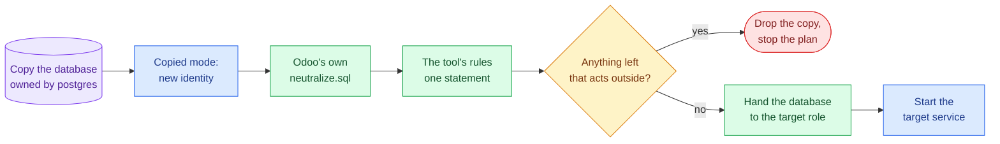

# Managing existing instances

Once an instance exists under `/opt/odoo`, **Manage instances** handles its day-2 operations and **Instance
services** (main menu) starts and stops services. Instances are discovered automatically; you may also type a
known name.

**Manage instances** groups its actions into three submenus — **Status & health**, **Configuration**,
**Backups & duplication** — plus **Delete instance**. This page follows that order.

## Status & health

The status views are shown on demand:

- **Status: locations & names** — the instance's expected paths and derived names.
- **Status: detected resources** — Linux user, home, config file, systemd service (present and active), DB
  role, data dir, and TLS certificate mode (self-signed / custom CA / custom external / Let's Encrypt /
  incomplete / not configured). Optionally connects to PostgreSQL to list the databases its role owns or that
  are named like it.
- **Status: config values** — useful keys read from the instance's `odoo.conf`.
- **Status: security & production** — the posture checks below.

Other entries of this submenu have their own pages: [Health check](health-check.md),
[Addon inventory](addon-inventory.md) and [Disk usage and cleanup](disk-usage.md). **Check a copy is
neutralised** is described under [neutralisation](#restore-and-duplicate--copied-vs-moved).

### Security & production posture

Each check is flagged `OK` / `WARN` / `INFO` with a reason, read from the instance's `odoo.conf` and host facts;
nothing is changed. The [server report](../server-audit.md) shows the same checks for every instance.

- **Database manager (`list_db`)** — exposed vs disabled.
- **dbfilter** — set vs unset.
- **Master / DB passwords** — guessable when they equal the instance name; a **hashed** master password is
  `OK`.
- **wkhtmltopdf** — presence and version (patched vs un-patched).
- **workers** — sizing against the detected CPU count.
- **`db_sslmode`** — for a remote DB host; a local host is `OK`.
- **`proxy_mode`** — must be `True` behind Nginx.

## Configuration

### Update existing configuration

Rewrites the instance's `odoo.conf` and systemd unit with new values, and optionally its Nginx vhost. First it
**backs up** the current config, unit and vhosts into one private timestamped directory under
`/var/backups/<instance>/config_preupdate/`.

- The current `odoo.conf` is **merged**, not replaced: `addons_path`, `data_dir`, `logfile`, `http_interface`
  and `without_demo` keep their value, and every key the tool does not write (`smtp_*`, `server_wide_modules`,
  `db_name`, …) is carried over.
- **Nothing is reinstalled** — no apt, clone or pip run — so the venv's pinned setuptools stays as it is.
- The Odoo version is read from the instance's checkout and the domain from its vhost.
- Passwords are kept unless you choose to set new ones; a new DB password is also set on the local role.
- A new DB password is set on the local role first; then the login is checked with the new values, and only
  then are the files written — a typo leaves the running configuration as it was.
- A running service is **restarted**, so the change is live when the plan ends. Autostart is left as it was. With
  a new password for a **remote** role the service is not restarted: set the password there, then restart it.

To go back, copy the files from the `config_preupdate/<timestamp>` directory and restart the service.

### Other configuration actions

- **Repair instance Nginx logs** recreates the per-instance access/error logs with their ownership
  (`www-data:adm`, mode `640`) and reopens Nginx's logs.
- **Log rotation** — see [Log rotation](log-rotation.md).
- **Install Python packages in the venv** installs into the instance's virtualenv from a requirements file or an
  inline package list, running pip as the instance user. Separate packages with commas (`requests, lxml`); a
  version range keeps its own comma (`babel>=2.14,<3`), and pip options (`--index-url …`) are refused.

## Backups & duplication

> **Credentials are asked once per session:** the first data action that needs a database connection asks for
> host, port, user and password (without echo); later actions offer to reuse them.

### Backups

**Create backup** exports the database and/or filestore into the backup directory you choose — a dedicated one,
such as `/var/backups/<instance>`; a shared directory (`/tmp`, `/var/backups`, …) is refused:

- Database → `pg_dump -Fc` → `<instance>--<db>--<timestamp>.dump`
- Filestore → gzipped tar → `<instance>--<db>--<timestamp>.filestore.tar.gz`

The name carries the database, so retention keeps N backups of each database
([Disk usage and backup retention](disk-usage.md)). The directory is private (`700`) and the files are readable
by root only: a dump holds password hashes, API keys and mail or payment secrets.
**Scheduled backups** run the same backup on a systemd timer — see [Scheduled backups](scheduled-backups.md).

### Restore and duplicate — copied vs moved

**Restore backup**, **Duplicate database** and **Duplicate instance** ask how the copy relates to its source,
and each asks for its confirmation phrase (`RESTORE <instance>`, `DUPLICATE <source>`, or `REPLACE <target>`
for a refresh in place):

- **Copied (new UUID on target)** — the target gets its own `database.uuid`, `database.secret` and creation
  date, as Odoo's own copy does.
- **Moved (keep UUID)** — the target keeps its identity: the database "moves".
- **Neutralize** (recommended) — the copy cannot act as production. On 16.0–19.0 it first runs Odoo's own
  neutralisation: the `neutralize.sql` of every module installed in the copy, read from the instance's
  checkout, including payment terminals and foreign EDIs. Then, on every version from 12 to 19, it applies the
  tool's own rules, which follow Odoo's and add the OCA modules a Spanish or queue-based instance runs:
  - crons off, except Odoo's autovacuum and queue_job's cleanup; queued jobs held;
  - mail:
    - outgoing mail servers are switched off, their credentials dropped and their host pointed nowhere;
    - fetchmail is off and templates' fixed servers are cleared;
    - one active **mail sink** (`invalid:1025`, logging in) stays, so Odoo never falls back to the
      `smtp_server` of `odoo.conf`;
  - payment providers, external carriers and their production mode, OAuth providers;
  - Google and Microsoft calendar tokens, webhooks, IAP accounts, web push keys and devices, cloud storage,
    certificate and SMS passwords;
  - test mode for the tax and invoicing links:
    - Spain: SII, TicketBAI and VERI*FACTU, both Odoo's and OCA's;
    - the EDI proxy, Peppol, and the Malaysian and Greek EDI;
  - website domain and CDN cleared, `web.base.url` pointing at the target, the "neutralised" banner and flag.

  The rules, each with its source, are in `instance_manager/neutralise.py`. Everything runs as the copy's owner
  role, not as the PostgreSQL superuser, so code the source database carries (a trigger, a function) gets no
  more rights than its own role has.

A copy is never visible to a running Odoo before it is neutralised. An Odoo's cron worker lists every database
its role owns, whatever the `dbfilter`, and one with `db_name` set connects to it by name. So the copy is owned
by postgres, and closed to every role, until it is handed over. The whole copy is **one step**: if any part
fails, the database it created is dropped, and nothing half-made is left behind.

A **restore** into a local database goes the same way, restored as the instance's role; the service keeps
running. Into a remote database it uses the credentials you give: the service is stopped while the copy is
restored and neutralised, and started again afterwards — also if the restore fails, which drops the database it
created.

A module update switches crons back on. **Check a copy is neutralised** (in *Status & health*) lists, read-only,
what in a database can still act on the outside, rule by rule, whether the mail sink is in place, and any
`cli` mail server.

A copy an interrupted run left behind (owned by postgres, marked as unfinished) is recognised and replaced by
the next restore or duplication; any other database is never taken for one.

Restore refuses to overwrite an existing target **database**. An existing target **filestore** needs an explicit
overwrite, and is then moved aside to `<filestore>.replaced-<timestamp>`, not deleted; the restored files are
handed to the instance user. When the data dir may be shared with other instances (a custom `data_dir`), only
the restored database's filestore changes owner.

### Duplicate instance — replica or refresh

*Duplicate instance* needs a local PostgreSQL; for a remote database use Backup and Restore. You pick the copy
method: **pg_dump → restore** (re-owns every object to the target role; recommended) or a fast **template**
copy, which keeps the source role as owner of every table and is therefore refused whenever the target role
differs from the source database's owner.

- **Target does not exist → replica.** The tool provisions the whole instance: system user, home, the
  **source's core** (Odoo or OCB) at its branch, a virtualenv built with the Python the version needs on this
  host, `odoo.conf` with its own data dir, systemd service, and optionally Nginx — following the same prompts as
  a fresh install, with free internal ports suggested. With Nginx, the domain must not be served by another
  vhost already. The replica's database role is named after its database, so a replica is always seeded with
  the pg_dump copy. It can also install the source venv's extra Python packages.
- **Target exists → refresh in place.** The tool stops the target service, replaces its database and filestore
  from the source, applies the semantics, and restarts it, without recreating its config or service. The
  target's database is dropped only when it belongs to the target's own role (from its `odoo.conf`) and you
  confirm the overwrite with `REPLACE <target>`; its previous filestore is moved aside, not deleted. The source
  instance or database can never be the target, and a name that is a system account or a half-removed
  instance is neither refreshed nor provisioned.

Every seeded database is **restricted to its owner** (`CONNECT` revoked from `PUBLIC`, granted to the owning
role), and the target's data dir is owned by the target user.

### Duplicate database

Copies one database within the instance, with the same copy methods and semantics and an optional filestore
copy into the instance's data dir. It touches no service or config, asks before overwriting an existing target
database, and refuses one owned by another role. Local PostgreSQL only.

## Instance services

**Instance services** (main menu) lists the instance services with their run and autostart state, and offers
start, stop, restart, enable autostart and disable autostart — each the single matching `systemctl` command,
previewed and confirmed.

## Removing an instance

Two levels, both phrase-gated and asked before the plan is shown:

| Action | Removes | Phrase |
|--------|---------|--------|
| **Delete instance** (in *Manage instances*) | Service, backup timer, config, logrotate policy, home, Nginx vhosts, SSL; optionally the database (if its owner is the instance's role) and one database's filestore | `DELETE <instance>` |
| **Remove instances** (main menu → total purge) | Everything above **plus** the Linux user, Odoo and Nginx logs, the fail2ban jail, the instance's filestores, its databases, and its PostgreSQL roles | `DELETE-ALL <instance>` |

Both reload Nginx only when it is installed, and go on if `nginx -t` fails because of another site.

**Delete instance keeps the filestores you did not ask to delete.** An instance installed with
`data_dir = /var/lib/odoo/<instance>` keeps its data dir where it is. An older instance without a `data_dir`
keeps its filestores inside the home, so the plan first moves its data dir to
`/var/backups/<instance>/kept-data-dir-<timestamp>` and only then removes the home.

The **total purge** selects the databases the instance's DB role owns and the one named exactly like the
instance, plus any you add. A filestore folder, or a name that merely starts with the instance name (`shop2`,
`shop_eu` when purging `shop`), is listed as **not selected**; add those yourself if they belong to it. The role
cannot be `postgres` or another superuser. When another instance connects with the same DB role, the purge says
so, selects nothing by owner and keeps the role. Without admin DB access it performs the local cleanup only.

The databases are dropped first, then their files. The instance's own data dir (`/var/lib/odoo/<instance>`) is
removed whole; from any other data dir, which other instances may share, only the selected databases'
filestores are removed. The Linux user is removed only when its home is `/opt/odoo/<instance>`. The full
contract is the [removal spec](../../openspec/specs/instance-removal/spec.md).

## Related

- [Installing and provisioning instances](../installation.md)
- [Configuration reference](../configuration-reference.md)
- [Fail2ban protection](../security/security-fail2ban.md)
