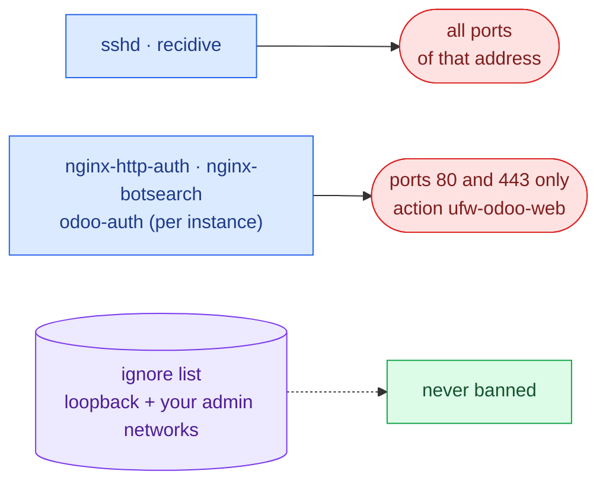

# Fail2ban protection

The **Fail2ban security** menu installs and operates Fail2ban for the host and for individual Odoo
instances. The status header shows service/enabled state and tolerates a socket that has not yet come up
(reported as *waiting*, not an error).

## Secure base setup

**Install / configure secure baseline** installs Fail2ban (if missing) and writes a base configuration with
`ufw` as the ban action (for `recidive` too), enabling `sshd` and `recidive`, plus `nginx-http-auth` and
`nginx-botsearch` **only when the host has nginx logs** — fail2ban refuses its whole configuration, the `sshd`
jail included, when a jail's log file is missing. You supply extra admin IPs/networks to ignore (loopback is
always ignored) and tune `bantime`, `findtime`, `maxretry`, and the recidive bantime.

The file is written through a **staged step**: it is kept only if `fail2ban-client -t` accepts the whole
configuration, otherwise the previous one is put back and the plan stops. Then the service is enabled and
reloaded, and the plan waits for the socket.

**What a ban blocks.**

A failed Odoo or web login therefore never blocks SSH. The web bans use the tool's own `ufw-odoo-web` action
(`/etc/fail2ban/action.d/ufw-odoo-web.conf`), which rejects the address on ports 80 and 443. fail2ban's own
`ufw[application="Nginx Full"]` is not used. On fail2ban 0.11.2 (Ubuntu 22.04, Debian 11) it passes the profile
name unquoted, so ufw refuses every ban. On 1.0 and later it bans every port when the profile is missing.

The base jails set `backend` per jail, never for all of them. Where `/var/log/auth.log` does not exist (Debian 12,
or a host without rsyslog), `sshd` reads the journal, and the plan installs `python3-systemd` for it. Durations
use fail2ban's units (`10m`, `1h`, `1d`). The ignore list takes addresses or networks and starts with the address
your SSH session comes from. Every write is staged, and a refused configuration, a failed write or an
interruption puts the previous files back.

> **UFW prerequisite:** the ban action is `ufw`, so bans only take effect while **UFW is installed and
> active**. This menu does not install UFW: set it up from **Firewall (UFW)**, which allows SSH before enabling
> it ([Firewall](firewall.md)). Until then the jails run but block nothing.

## Per-instance Odoo jail

**Enable per-instance Odoo protection** installs the shared `odoo-auth` filter and writes a dedicated
`odoo-auth-<instance>` jail bound to the instance log, both through the validated staged step.

The filter matches Odoo's own login-failure line, which changed in Odoo 19:

- Odoo 12–18: `Login failed for db:<db> login:<login> from <ip>`;
- Odoo 19: `Login failed for login:<login> from <ip>`.

It is anchored on the `odoo.addons.base.models.res_users` logger, and only the request's performance numbers
may follow the address. The plan **tests the filter** with `fail2ban-regex` on one line of each format and fails
unless both match (a test against the instance's own log could not tell: `fail2ban-regex` succeeds with zero
matches).

### Real-client-IP check (important behind a proxy)

Odoo sits behind Nginx, so its log may record the **proxy/gateway** IP instead of the real client. Banning
those would lock out your own infrastructure. The tool assesses the **last 300 lines** of the log and matches
**IPv4 addresses only**:

- **Public IPs present** → reported OK; activation proceeds.
- **Only private/loopback IPs** → warns of the risk and **requires explicit confirmation** before enabling the
  jail. Recommendation: fix forwarded headers (`proxy_mode`, `X-Forwarded-For`) so Odoo logs the real client
  IP first.
- **Unknown** (log missing/unreadable or no parseable IPv4) → warns, but does not by itself block enabling the
  jail.

Run this check on its own with **Check the real IP in the Odoo log**.

## Operating bans

- **Show status and jails** / **Show jail detail** — inspect the current jails and a jail's detail.
- **Unban an IP from a jail** — lists the currently banned IPs for a jail (or accept a manual IP) and runs
  `fail2ban-client set <jail> unbanip <ip>`.
- **Test the Odoo regex** — ensures the default `odoo-auth` filter exists, validates the log and filter files,
  and runs `fail2ban-regex`.

## Related

- [Instance management](../operations/instance-management.md)
- [Fail2ban spec](../../openspec/specs/fail2ban-protection/spec.md) — the full behavior contract.
